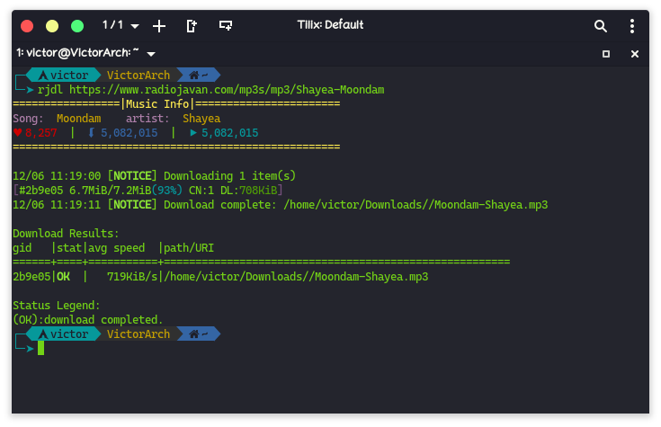

# rjdl

rjdl is a command-line music downloader script for [radiojavan.com](https://radiojavan.com)
 Thanks to [RadioJavanBot](https://github.com/iw4p/RadioJavanBot) for API

 

## Installation

for using this program ,you can run `radiojavan-dl.py` <br> or install it using installer in linux machins</br>

>### Note
>This script uses aria2c download manager behind the scenes, so make sure it is already installed on your operating system 


first of all you need to clone the repository :

```bash
git clone "https://github.com/Gictorbit/rjdl.git" && cd rjdl
```

and then should install python package reqirements

```bash
pip install -r requirements.txt
```
>### install with installer script
>```bash
>chmod +x install.sh
>./install.sh
>```

>### run manually
>```bash
>cd rjdl
>python3 radiojavan-dl.py
>```

## Usage

### positional arguments:
*  url                 the link of music in radiojavan.com

### optional arguments:
<pre>
  -h , --help          show this help message and exit
  -d , --dir          the path for saving mp3 file. Default: ~/Downloads
  -c , --connection   The maximum number of connections to one server for each download. Default: 1
  -l , --lyric         download lyric of music and save it in specified dir. Default: ~/Downloads
  -p , --photo         download photo of music and save it in specified dir. Default: ~/Downloads
</pre>

## License


GNU General Public License v3.0